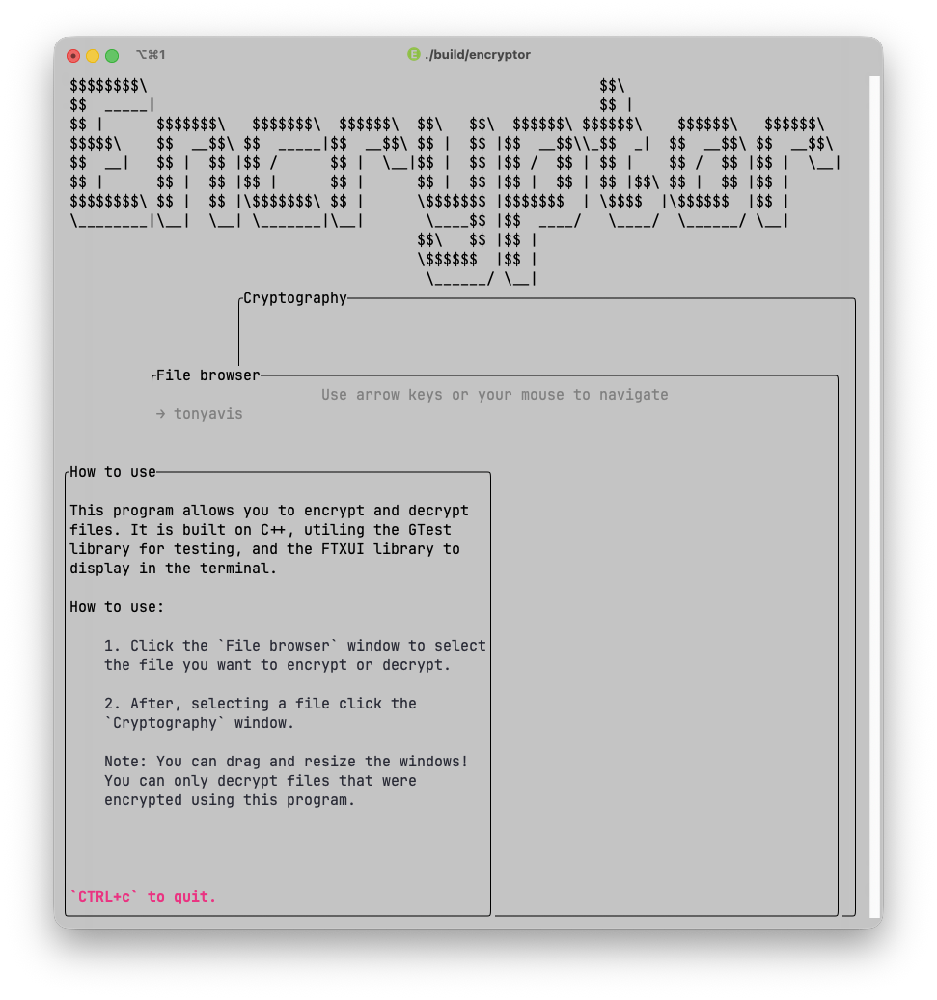
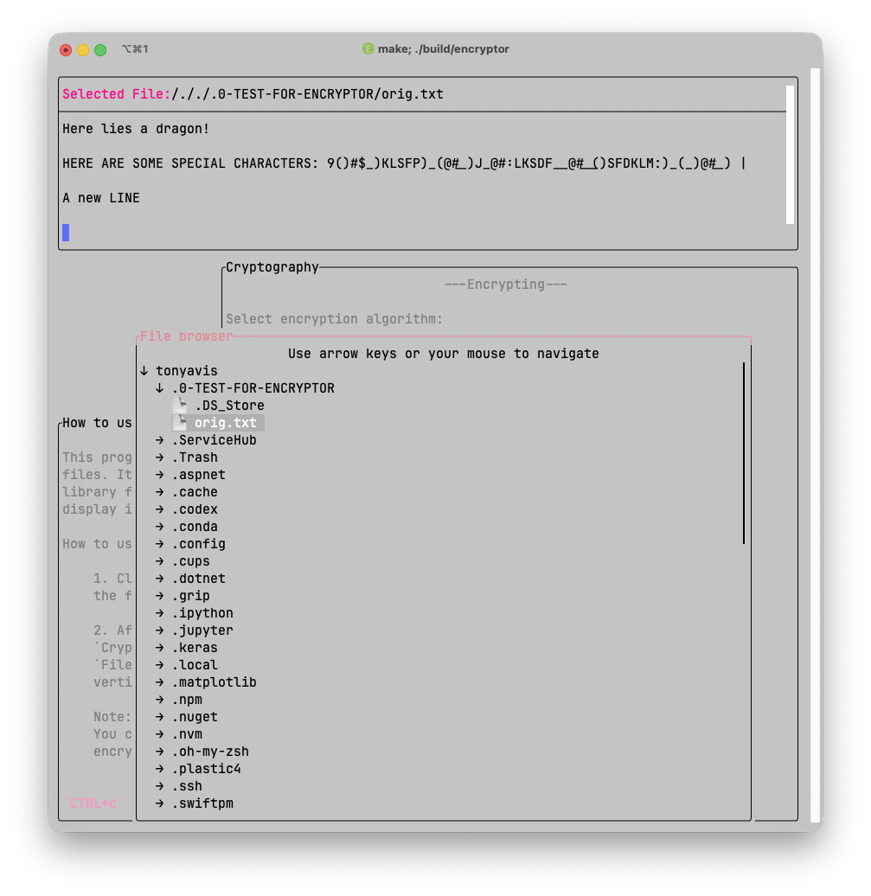
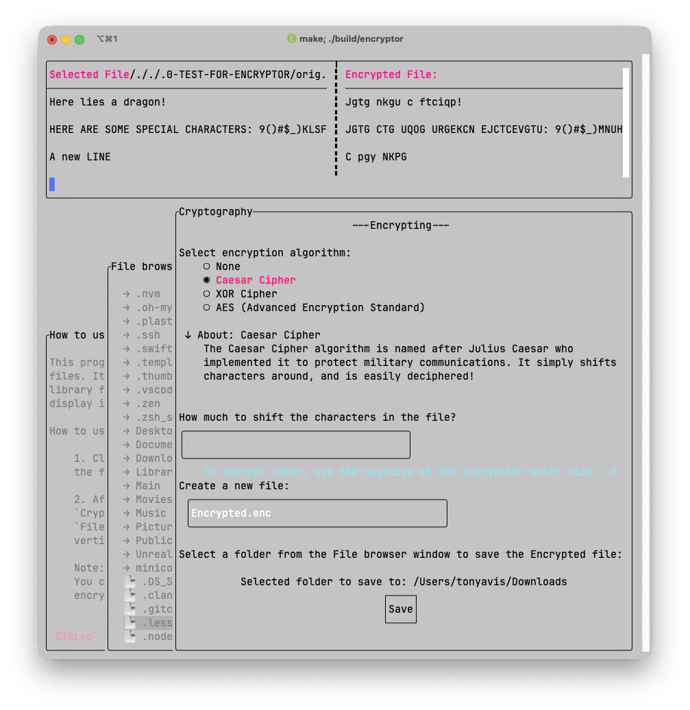

# Encryptor

- **//TODO's:**
  - Make the ASCII art interactive.
  - Add algorithms:
    - XOR
    - AES

**Cryptography:** A file encrypt/decrypt terminal user interface (TUI) built on `C++`. This project is a portfolio showcase, don't use for state-of-the-art encryption, use `openssl`.

<span align="center">
    
    
    
</span>

- **Prerequisite:**

  - Install necessary packages with `homebrew` globally:
    - [Google Test (GTest)](https://github.com/google/googletest) & [FTXUI](https://github.com/ArthurSonzogni/FTXUI)

        ```shell
        brew install googletest;
        brew install ftxui;
        ```

    - `clang` compiler.

## Validating Encryptions

Check if a decrypted file is the same as the original pre-encrypted file.

- Compare hashes with `sha256sum`

    ```shell
    sha256sum file_to_encrypt_orig.txt decrypted_file.txt
    ```

## How To Build & Install Locally

`Build:`

```shell
# Build the executable application.
make
# Run application
../build/encryptor;
```

`If Test:`

```shell
# Clean, build, and run the tests
make clean; make test
```

`Install Locally:` # TODO 